# System Architecture

This document provides visual representations of how Claude Master and Commander works, from system architecture to user workflows.

## System Architecture Overview

The following diagram shows the complete technical architecture of Claude Master and Commander:

```mermaid
graph TB
    %% User Interface Layer
    User[👤 Developer] --> Install[📥 Installation]
    User --> CLI[💻 CLI Commands]
    
    %% Installation Process
    Install --> InstallScript[install.sh]
    InstallScript --> Prerequisites{Check Prerequisites}
    Prerequisites -->|❌ Missing| InstallDeps[Install Node.js/Git]
    Prerequisites -->|✅ Ready| CloneRepo[Clone Repository]
    CloneRepo --> SetupShell[Setup Shell Integration]
    SetupShell --> CreateAliases[Create CLI Aliases]
    CreateAliases --> ProjectsDir[Create ~/Projects Directory]
    
    %% CLI Command Layer
    CLI --> PRDNew[prd new]
    CLI --> PRDGenerate[prd-generate]
    CLI --> PRDStatus[prd-status]
    CLI --> PRDList[prd-list]
    CLI --> PRDCD[prd-cd]
    
    %% Core Scripts
    PRDNew --> PRDHelper[scripts/prd-helper.sh]
    PRDGenerate --> TaskGenerator[scripts/prd-task-generator.js]
    PRDStatus --> PRDHelper
    PRDList --> PRDHelper
    PRDCD --> PRDHelper
    
    %% Project Creation Workflow
    PRDHelper --> CreateProject{Create New Project}
    CreateProject --> ProjectStructure[Create Project Structure]
    ProjectStructure --> ProjectDir[~/Projects/project-name/]
    ProjectDir --> DocsDir[docs/]
    ProjectDir --> SrcDir[src/]
    ProjectDir --> TestsDir[tests/]
    ProjectDir --> ScriptsDir[scripts/]
    ProjectDir --> AssetsDir[assets/]
    
    %% PRD Template System
    DocsDir --> PRDTemplate[templates/prd-template.md]
    PRDTemplate --> PRDFile[docs/prd.md]
    PRDFile --> PRDConfig[.prd-config.json]
    
    %% PRD Analysis & Task Generation
    TaskGenerator --> PRDParser[PRD Content Parser]
    PRDParser --> ExtractSections{Extract Sections}
    ExtractSections --> FunctionalReqs[Functional Requirements]
    ExtractSections --> TechnicalReqs[Technical Requirements]
    ExtractSections --> ImplementationPlan[Implementation Plan]
    
    %% Task Generation Engine
    FunctionalReqs --> TaskEngine[Task Generation Engine]
    TechnicalReqs --> TaskEngine
    ImplementationPlan --> TaskEngine
    
    TaskEngine --> FoundationTasks[Foundation Tasks]
    TaskEngine --> FeatureTasks[Feature Tasks]
    TaskEngine --> TechnicalTasks[Technical Tasks]
    TaskEngine --> DeploymentTasks[Deployment Tasks]
    
    %% Task Structure
    FoundationTasks --> TasksFile[docs/tasks.md]
    FeatureTasks --> TasksFile
    TechnicalTasks --> TasksFile
    DeploymentTasks --> TasksFile
    
    TasksFile --> TaskFormat[Task Format:<br/>🔲 Not Started<br/>🔄 In Progress<br/>✅ Completed<br/>❌ Blocked<br/>⏸️ On Hold]
    
    %% Claude Integration Layer
    TasksFile --> ClaudeIntegration[🤖 Claude Desktop Commander Integration]
    ClaudeIntegration --> AIAnalysis[AI-Powered Analysis]
    AIAnalysis --> PRDReview[PRD Review & Suggestions]
    AIAnalysis --> TaskBreakdown[Task Breakdown Assistance]
    AIAnalysis --> CodeGeneration[Code Generation]
    AIAnalysis --> ArchitecturalGuidance[Architectural Guidance]
    
    %% Progress Tracking
    TasksFile --> StatusTracking[Progress Tracking]
    StatusTracking --> PhaseManagement[Phase Management]
    StatusTracking --> NextActions[Next Action Recommendations]
    StatusTracking --> CompletionMetrics[Completion Metrics]
    
    %% Project Management Features
    PRDConfig --> ProjectMetadata[Project Metadata]
    ProjectMetadata --> ProjectName[Project Name]
    ProjectMetadata --> CreatedDate[Created Date]
    ProjectMetadata --> CurrentPhase[Current Phase]
    ProjectMetadata --> TaskCounter[Task Counter]
    ProjectMetadata --> ProjectStatus[Project Status]
    
    %% Shell Integration
    CreateAliases --> ShellProfile[~/.zshrc or ~/.bashrc]
    ShellProfile --> CommandAliases[Command Aliases:<br/>prd, prd-new, prd-generate<br/>prd-status, prd-list, prd-cd]
    
    %% File System Integration
    ProjectsDir --> MultipleProjects[Multiple PRD Projects]
    MultipleProjects --> ProjectA[Project A]
    MultipleProjects --> ProjectB[Project B]
    MultipleProjects --> ProjectN[Project N...]
    
    %% Development Workflow
    User --> WorkflowSteps[Development Workflow]
    WorkflowSteps --> Step1[1. Create PRD Project]
    WorkflowSteps --> Step2[2. Write Detailed PRD]
    WorkflowSteps --> Step3[3. Generate Task Breakdown]
    WorkflowSteps --> Step4[4. Development with Claude]
    WorkflowSteps --> Step5[5. Track Progress]
    
    Step1 --> PRDNew
    Step2 --> PRDFile
    Step3 --> PRDGenerate
    Step4 --> ClaudeIntegration
    Step5 --> StatusTracking
    
    %% External Dependencies
    TaskGenerator --> NodeJS[Node.js Runtime]
    PRDHelper --> BashZsh[Bash/Zsh Shell]
    ClaudeIntegration --> ClaudeDesktop[Claude Desktop Commander]
    
    %% Styling
    classDef userInterface fill:#e1f5fe
    classDef coreLogic fill:#f3e5f5
    classDef integration fill:#e8f5e8
    classDef storage fill:#fff3e0
    classDef workflow fill:#fce4ec
    
    class User,Install,CLI userInterface
    class PRDHelper,TaskGenerator,TaskEngine coreLogic
    class ClaudeIntegration,AIAnalysis,ClaudeDesktop integration
    class ProjectsDir,TasksFile,PRDFile,PRDConfig storage
    class WorkflowSteps,Step1,Step2,Step3,Step4,Step5 workflow
```



## Key Architectural Components

### **Multi-Layer Design**
1. **User Interface Layer**: CLI commands with intuitive aliases
2. **Business Logic Layer**: Shell scripts + Node.js task generation  
3. **Integration Layer**: Claude Desktop Commander connectivity
4. **Storage Layer**: File-based project structure with JSON metadata
5. **Template Layer**: Professional PRD and project templates

### **Core Scripts**
- **`prd-helper.sh`**: Main CLI orchestration and project management
- **`prd-task-generator.js`**: AI-powered task generation from PRD analysis
- **`install.sh`**: One-line installation with dependency checking

### **Project Structure**
Each PRD project follows a consistent structure:
```
project-name/
├── .prd-config.json          # Project metadata
├── docs/
│   ├── prd.md               # Product Requirements Document
│   └── tasks.md             # Generated task breakdown
├── src/                     # Source code
├── tests/                   # Test files
├── scripts/                 # Project scripts
└── assets/                  # Static assets
```

### **Claude Integration Points**
- **PRD Analysis**: AI review and improvement suggestions
- **Task Breakdown**: Intelligent decomposition of complex requirements
- **Code Generation**: Automated boilerplate and implementation
- **Architectural Guidance**: Best practices and design decisions
- **Progress Tracking**: Status monitoring and next action recommendations

## Workflow Philosophy

### **PRD-First Approach**
Every project begins with comprehensive planning through detailed Product Requirements Documents, ensuring clear vision and structured development.

### **AI-Enhanced Development**
Claude Desktop Commander integration provides intelligent assistance throughout the entire development lifecycle, from planning to implementation.

### **Visual Progress Tracking**
Clear status indicators and completion metrics help maintain momentum and provide visibility into project progress.

### **Modular Architecture** 
Each component serves a specific purpose while maintaining clean interfaces and separation of concerns.

### **Shell-Native Integration**
Works seamlessly with existing developer workflows through native shell integration and familiar command patterns.
