# Workflow Process

This document illustrates the complete user journey and workflow process for Claude Master and Commander, from installation to project completion.

## Complete Workflow Process

The following sequence diagram shows the detailed workflow process:

```mermaid
sequenceDiagram
    participant User as 👤 Developer
    participant Install as 📥 Install Script
    participant CLI as 💻 CLI Commands
    participant Helper as 🛠️ PRD Helper
    participant Generator as ⚙️ Task Generator
    participant Claude as 🤖 Claude Integration
    participant FS as 📁 File System
    
    %% Installation Phase
    Note over User,FS: Installation & Setup Phase
    User->>Install: curl install.sh | bash
    Install->>Install: Check Node.js & Git
    Install->>FS: Clone repository
    Install->>FS: Setup shell integration
    Install->>User: ✅ Installation complete
    
    %% Project Creation Phase
    Note over User,FS: Project Creation Phase
    User->>CLI: cmc new my-awesome-app
    CLI->>Helper: create_new_project()
    Helper->>FS: Create ~/Projects/my-awesome-app/
    Helper->>FS: Create directory structure
    FS-->>Helper: docs/, src/, tests/, scripts/, assets/
    Helper->>FS: Copy PRD template
    Helper->>FS: Create .cmc-config.json
    Helper->>FS: Create initial tasks.md
    Helper->>User: 📁 Project created successfully
    
    %% PRD Writing Phase
    Note over User,FS: PRD Development Phase
    User->>FS: Edit docs/prd.md
    Note right of User: User writes detailed:<br/>- Problem statement<br/>- Solution overview<br/>- Functional requirements<br/>- Technical architecture<br/>- Implementation phases
    
    %% Task Generation Phase
    Note over User,FS: Task Generation Phase
    User->>CLI: cmc-generate docs/prd.md
    CLI->>Generator: parsePRD(prdFilePath)
    Generator->>FS: Read PRD content
    FS-->>Generator: PRD markdown text
    
    Generator->>Generator: extractPRDSections()
    Note right of Generator: Parse:<br/>- Functional Requirements<br/>- Implementation Plan<br/>- Technical Requirements
    
    Generator->>Generator: generateTasks()
    Note right of Generator: Create:<br/>- Foundation tasks<br/>- Feature tasks<br/>- Technical tasks<br/>- Deployment tasks
    
    Generator->>Generator: formatTasksAsMarkdown()
    Generator->>FS: Save docs/tasks.md
    Generator->>User: ✅ Task breakdown generated
    
    %% Development Phase with Claude
    Note over User,FS: AI-Enhanced Development Phase
    User->>Claude: "Review my PRD and suggest improvements"
    Claude->>FS: Read docs/prd.md
    Claude->>User: 💡 PRD analysis and suggestions
    
    User->>Claude: "Help me implement TASK-003"
    Claude->>FS: Read docs/tasks.md
    Claude->>FS: Read project structure
    Claude->>Claude: Generate implementation plan
    Claude->>FS: Create/modify source files
    Claude->>User: 🔧 Code generated and files updated
    
    User->>Claude: "Generate database schema"
    Claude->>FS: Analyze technical requirements
    Claude->>FS: Create schema files
    Claude->>User: 🗄️ Database schema created
    
    %% Progress Tracking Phase
    Note over User,FS: Progress Tracking Phase
    User->>CLI: cmc-status .
    CLI->>Helper: show_project_status()
    Helper->>FS: Read .cmc-config.json
    Helper->>FS: Read docs/tasks.md
    Helper->>Helper: Calculate completion metrics
    Helper->>User: 📊 Project status report
    
    User->>FS: Update task status (🔲 → 🔄 → ✅)
    
    %% Project Navigation
    Note over User,FS: Project Management Phase
    User->>CLI: cmc-list
    CLI->>Helper: list_projects()
    Helper->>FS: Find all .cmc-config.json files
    Helper->>User: 📋 List of all CMC projects
    
    User->>CLI: cmc-cd my-awesome-app
    CLI->>Helper: Navigate to project
    Helper->>Helper: Change directory
    Helper->>CLI: cmc-status .
    Helper->>User: 📁 Project directory + status
    
    %% Iterative Development Loop
    Note over User,FS: Iterative Development Loop
    loop Continuous Development
        User->>Claude: "What should I work on next?"
        Claude->>FS: Analyze current progress
        Claude->>User: 🎯 Next action recommendations
        
        User->>Claude: "Implement [specific feature]"
        Claude->>FS: Generate/modify code
        Claude->>User: ✅ Feature implemented
        
        User->>FS: Update task status
        User->>CLI: cmc-status .
        CLI->>User: 📈 Updated progress
    end
    
    %% Project Completion
    Note over User,FS: Project Completion Phase
    User->>FS: Mark final tasks as ✅
    User->>CLI: cmc-status .
    CLI->>User: 🎉 Project completed!
    
    %% Architecture Notes
    Note over User,FS: Key Architecture Benefits
    Note right of User: • PRD-driven methodology<br/>• AI-enhanced development<br/>• Visual progress tracking<br/>• Consistent project structure<br/>• Shell integration<br/>• Claude ecosystem compatibility
```

## Workflow Phases Explained

### 1. **Installation & Setup Phase**
- **One-line installation** with automatic dependency checking
- **Shell integration** adds convenient CLI aliases
- **Project directory creation** sets up workspace structure

### 2. **Project Creation Phase**
- **Structured project scaffolding** ensures consistency
- **PRD template copying** provides professional starting point
- **Metadata initialization** tracks project configuration

### 3. **PRD Development Phase**
- **Professional documentation** captures requirements comprehensively
- **Structured sections** ensure nothing is overlooked
- **Version control integration** tracks requirement evolution

### 4. **Task Generation Phase**
- **AI-powered analysis** extracts actionable tasks from requirements
- **Intelligent categorization** organizes tasks by phase and priority
- **Visual status tracking** provides clear progress indicators

### 5. **AI-Enhanced Development Phase**
- **Continuous Claude integration** provides intelligent assistance
- **Code generation** accelerates implementation
- **Architectural guidance** ensures best practices

### 6. **Progress Tracking Phase**
- **Real-time status monitoring** shows completion metrics
- **Next action recommendations** maintain development momentum
- **Phase management** organizes work into logical stages

### 7. **Iterative Development Loop**
- **Continuous improvement cycle** refines implementation
- **AI-assisted decision making** optimizes development choices
- **Progress visibility** maintains team alignment

## Key Benefits

### **PRD-Driven Methodology**
- Ensures comprehensive planning before implementation
- Provides clear success criteria and acceptance conditions
- Facilitates stakeholder alignment and communication

### **AI-Enhanced Development**
- Accelerates code generation and boilerplate creation
- Provides architectural guidance and best practices
- Enables intelligent task breakdown and prioritization

### **Visual Progress Tracking**
- Clear status indicators show project health at a glance
- Completion metrics provide motivation and accountability
- Phase organization helps manage complex projects

### **Consistent Project Structure**
- Standardized layout improves team collaboration
- Predictable organization reduces onboarding time
- Version control integration supports collaborative development

### **Shell Integration**
- Native command-line interface fits developer workflows
- Convenient aliases reduce typing and improve efficiency
- Cross-project navigation and management capabilities

### **Claude Ecosystem Compatibility**
- Leverages existing Claude Desktop Commander investment
- Seamless integration with Claude's development assistance
- Consistent experience across Claude-powered tools
